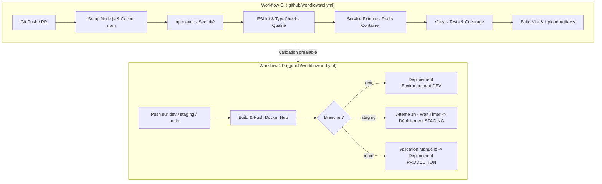

# Todo List CI/CD 🚀

[](https://github.com/LemaitreEnzo/todo-list-ci-cd/actions/workflows/ci.yml)
[](https://github.com/LemaitreEnzo/todo-list-ci-cd/actions/workflows/cd.yml)

> Projet de TP : Création, test, conteneurisation et déploiement continu d'une application Node.js / React avec GitHub Actions.

---

## 📌 Informations du Projet

- **Nom du projet** : `todo-list-ci-cd`
- **Dépôt GitHub** : [https://github.com/LemaitreEnzo/todo-list-ci-cd](https://github.com/LemaitreEnzo/todo-list-ci-cd)
- **Stack technique** : React 19, TypeScript, Vite, Vitest, Nginx, Docker, GitHub Actions

---

## 🎯 Architecture et Choix du Workflow

Le projet sépare rigoureusement l'**Intégration Continue (CI)** et le **Déploiement Continu (CD)** dans deux workflows distincts.



### 1. Intégration Continue (CI) - `ci.yml`

Déclenché à chaque `push` et `pull_request` sur les branches `dev`, `staging` et `main`.

| Élément | Choix technique & Justification |
| :--- | :--- |
| **Gestion du cache** | `actions/setup-node@v4` avec `cache: 'npm'` pour réutiliser les dépendances téléchargées et accélérer l'exécution du pipeline. |
| **Audit des dépendances** | `npm audit --audit-level=high` pour détecter et bloquer les vulnérabilités de sécurité critiques dans l'arbre de dépendances. |
| **Qualité du code** | `npm run lint` (ESLint 10) pour l'analyse statique et `npm run typecheck` (`tsc -b`) pour la sécurité du typage. |
| **Service externe** | Conteneur de service **Redis** (`redis:alpine`) provisionné sur le port `6379` avec healthcheck et test de connexion réseau via Node.js. |
| **Tests automatisés** | Exécution avec **Vitest** et React Testing Library (`npm run test:coverage`), garantissant la non-régression et mesurant la couverture de code. |
| **Création d'artefacts** | `actions/upload-artifact@v4` publiant le rapport de couverture (`coverage/`) et le livrable de production (`dist/`), conservés 7 jours. |

### 2. Déploiement Continu (CD) - `cd.yml`

Déclenché lors des `push` sur les branches de versionnement ou manuellement via `workflow_dispatch`.

| Environnement | Branche cible | Mécanisme de Déploiement & Règle de protection |
| :--- | :--- | :--- |
| **Build Docker** | `dev`, `staging`, `main` | Image multi-stage (Node 22 build -> Nginx Alpine). Push sur **Docker Hub** avec tags (`commit SHA`, `nom de branche`, et `latest` sur `main`) et cache de layers GitHub Actions (`gha`). |
| **Développement** | `dev` | Déploiement automatique continu via conteneur Docker. |
| **Pré-production** | `staging` | **Déploiement différé après 1 heure**, configuré nativement via la règle **Wait timer (60 minutes)** de l'environnement GitHub `staging`. |
| **Production** | `main` | **Déploiement manuel contrôlé**, protégé par la règle **Required reviewers** de l'environnement GitHub `production` (exige une validation humaine avant déclenchement). |

---

## 🛠️ Configuration des Secrets et Environnements GitHub

### 1. Secrets de Repository (`Settings > Secrets and variables > Actions`)

- `DOCKERHUB_USERNAME` : Nom d'utilisateur Docker Hub.
- `DOCKERHUB_TOKEN` : Token d'accès Docker Hub (avec droits `read/write`).
- `SSH_HOST` *(optionnel)* : IP ou nom d'hôte du serveur distant.
- `SSH_USER` *(optionnel)* : Utilisateur SSH du serveur.
- `SSH_PRIVATE_KEY` *(optionnel)* : Clé privée SSH pour le déploiement automatisé.
*(Note : Si les secrets SSH ne sont pas renseignés, le workflow exécute une étape de simulation documentée sans échouer).*

### 2. Environnements GitHub (`Settings > Environments`)

1. **`development`** : Pas de règle de restriction (déploiement direct).
2. **`staging`** :
   - Cocher **Wait timer** et saisir **`60`** minutes.
3. **`production`** :
   - Cocher **Required reviewers** et ajouter les membres autorisés à valider la mise en production.

---

## 🔍 Guide : Déboguer un Test ayant Échoué via les Logs GitHub Actions

Pour répondre à l'exigence de démonstration du TP :

1. **Provoquer une régression volontaire** :
   Dans `src/App.test.tsx`, modifier par exemple :
   ```typescript
   expect(screen.getByText(/Todo List CI\/CD/i)).toBeInTheDocument()
   // Remplacer par :
   expect(screen.getByText('Titre Inexistant')).toBeInTheDocument()
   ```
2. **Pousser la modification** :
   ```bash
   git commit -am "test: introduce intentional failure"
   git push origin dev
   ```
3. **Inspecter le journal d'exécution dans GitHub Actions** :
   - Aller dans l'onglet **Actions** du dépôt GitHub.
   - Cliquer sur le run CI en échec (croix rouge).
   - Cliquer sur le job `Continuous Integration (Audit, Lint, Test & Build)`.
   - Dérouler l'étape `Run automated tests with coverage`.
   - Observer l'erreur détaillée : Vitest indique le nom du fichier (`src/App.test.tsx`), la ligne précise de l'échec et la différence entre le résultat attendu et obtenu.
4. **Résolution du bug** :
   - Corriger l'assertion dans le code.
   - Pousser le correctif (`git commit -am "fix: correct test assertion" && git push origin dev`).
   - Vérifier que le statut passe au vert (✅).

---

## 💻 Commandes Utiles en Local

```bash
# Installation des dépendances
npm ci

# Lancement du serveur de développement
npm run dev

# Vérification du code (Linter ESLint)
npm run lint

# Vérification des types TypeScript
npm run typecheck

# Exécution des tests unitaires
npm test

# Exécution des tests avec rapport de couverture
npm run test:coverage

# Build de production
npm run build
```
